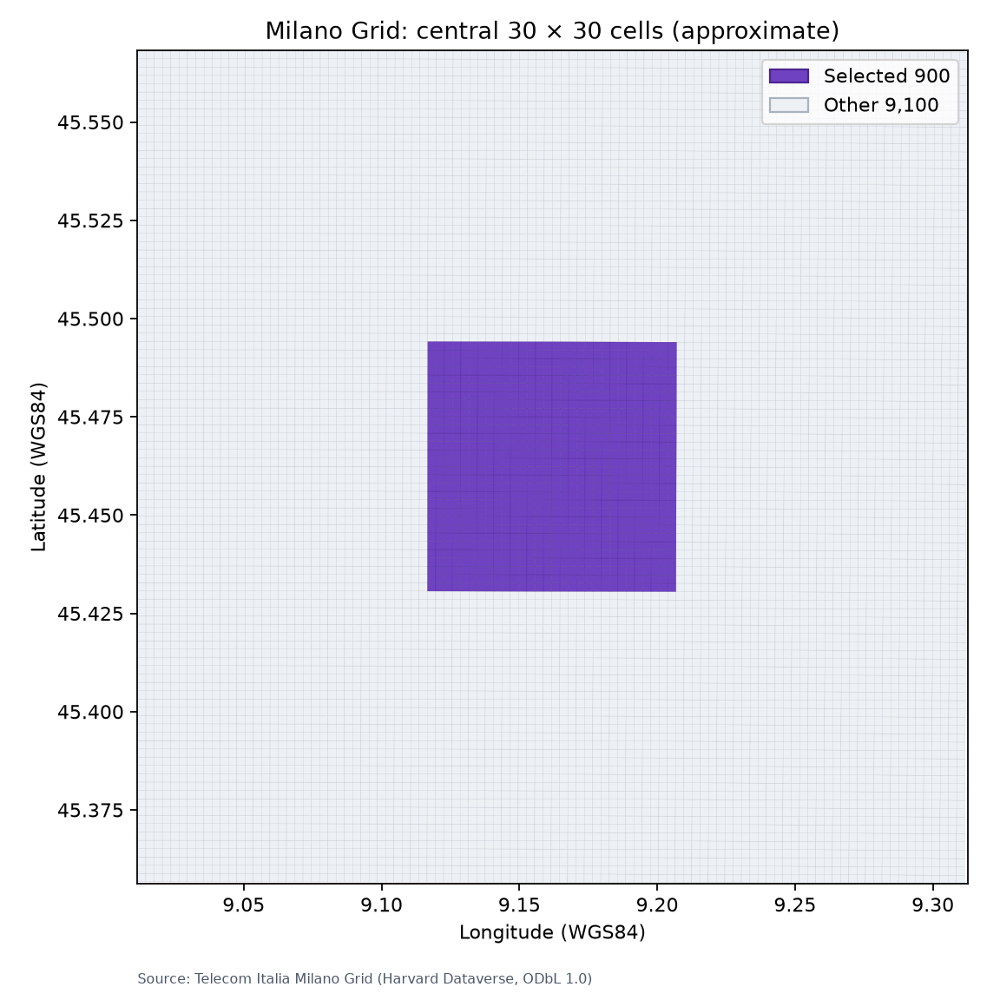

# 중앙 900셀 공간 선택과 검증

## 1. 목적

GECOS 논문은 Milano Grid 10,000개 셀 중 도시 중심의 `30×30=900`개 셀을
주요 실험 대상으로 사용한다. 하지만 논문과 공개 코드는 정확한 900개 cell ID,
공간 파일명과 선택 코드를 제공하지 않는다. 이 문서는 공식 Grid 좌표를 이용해
중앙 900셀을 결정론적으로 생성하고, 기존 Internet traffic 행렬에서 같은 행을
추출하는 과정을 설명한다.

이 저장소의 결과는 저자가 사용한 목록과 같다고 확인된 것이 아니다. 모든 설정과
산출물에는 다음 프로토콜 이름을 사용한다.

```text
central-900-approximate
```

## 2. 논문 사실과 저장소의 구현 가정

| 구분 | 내용 |
|---|---|
| 논문에서 확인 | 중앙의 900셀을 `30×30` 영역으로 표시하고 주요 실험에 사용함 |
| 논문에서 미공개 | 정확한 ID 목록, 영역 경계, GeoJSON 사용 여부와 선택 코드 |
| 이 저장소의 결정 | 공식 Milano Grid polygon centroid로 100×100 위치를 복원한 뒤 기하학적 중앙 30×30 선택 |
| 결과 해석 | 논문의 생략된 절차를 보완한 근사 재현이며 저자의 정확한 목록이라고 주장하지 않음 |

공간 파일은 저자의 절차를 단정하기 위해 사용하는 것이 아니다. 셀 ID만으로 중앙
영역을 계산한 결과가 실제 지도에서도 중앙에 있는지 독립적으로 검사하기 위해
사용한다.

## 3. 공간 데이터 출처와 무결성

- 데이터: *Milano Grid*
- 제공자: Telecom Italia
- DOI: <https://doi.org/10.7910/DVN/QJWLFU>
- Dataverse version: `1.3`
- 파일: `milano-grid.geojson`
- 파일 크기: `3,168,596 bytes`
- 공식 MD5: `e64ed3858e97347c14cd049efde8c7d3`
- 좌표계: WGS84, EPSG:4326
- 이용 조건: Open Database License(ODbL) 1.0
- 추적 metadata: [`metadata/milano_grid.json`](../metadata/milano_grid.json)

Harvard Dataverse의 공식 다운로드는 guestbook 응답을 요구한다. 이 저장소의 자동
다운로드는 공개 GitHub 미러의 변경 불가능한 commit을 사용하되, 다운로드 결과의
크기와 MD5가 공식 Dataverse 값과 정확히 같을 때만 파일을 게시한다. 따라서 획득
경로는 미러이지만 입력 바이트의 동일성 판단 기준은 공식 Dataverse metadata다.

직접 Dataverse에서 내려받은 파일이 이미 있으면 자동 다운로드를 하지 않고 같은
크기와 MD5인지 검사한 뒤 그대로 사용한다.

## 4. 환경 준비와 다운로드

공간 선택 환경은 Python 3.12에서 다음 버전으로 검증했다.

| 패키지 | 버전 | 용도 |
|---|---:|---|
| NumPy | 2.5.2 | memory map 입력, 부분집합과 통계 생성 |
| Matplotlib | 3.11.1 | Grid 선택 지도 생성 |

기존 전처리 가상환경에 공간 의존성을 추가한다.

```bash
python3 -m pip --python .venv/bin/python install --requirement requirements/spatial.txt
```

공식 checksum과 같은 GeoJSON을 준비한다.

```bash
.venv/bin/python -m scripts.fetch_milano_grid
```

정상 결과는 다음과 같다.

```text
Milano Grid 준비 완료: status=downloaded 또는 already_present,
bytes=3168596, md5=e64ed3858e97347c14cd049efde8c7d3
```

파일은 `data/raw/milano-grid.geojson`에 저장되며 Git에서 제외된다. 기존 파일의
checksum이 다르면 자동으로 덮어쓰지 않고 실패한다.

## 5. 선택 알고리즘

설정은
[`configs/select_central_900.json`](../configs/select_central_900.json)에 고정한다.

### 5.1 GeoJSON 구조 검증

선택 전에 다음 조건을 모두 확인한다.

1. 파일 크기와 MD5가 공식 Dataverse metadata와 일치함
2. root type이 `FeatureCollection`임
3. CRS가 `urn:ogc:def:crs:EPSG::4326`임
4. Feature가 정확히 10,000개임
5. `cellId`가 1부터 10,000까지 중복 없이 존재함
6. Feature의 0-based `id`와 `cellId` 관계가 일치함
7. 모든 geometry가 구멍 없는 Polygon이고 ring이 닫혀 있음
8. 모든 좌표가 유한한 경도·위도이며 polygon 면적이 0보다 큼

### 5.2 centroid 계산

각 Polygon의 면적 중심은 shoelace 공식으로 계산한다. 꼭짓점 좌표의 단순 평균을
쓰지 않으므로, WGS84로 변환되면서 셀이 약간 비스듬해져도 일관된 중심을 얻는다.

### 5.3 좌표로 100×100 위치 복원

Milano Grid는 WGS84 좌표에서 행마다 위도가, 열마다 경도가 조금씩 달라 단순히
고유 경도 100개와 고유 위도 100개를 찾을 수 없다. 따라서 다음 절차를 사용한다.

1. 10,000개 centroid를 위도 오름차순으로 정렬한다.
2. 서로 겹치지 않는 100개 latitude band로 나누고 band마다 100개 셀이 있는지
   확인한다.
3. 각 band 안에서 경도 오름차순으로 정렬해 column을 부여한다.
4. row는 남쪽에서 북쪽, column은 서쪽에서 동쪽 방향의 0-based 번호로 정의한다.
5. 좌표로 얻은 `(row, column)`이 다음 ID 공식과 10,000개 모두 일치하는지 확인한다.

```text
cell_id = row × 100 + column + 1
```

실제 데이터에서 인접 latitude band의 최소 간격은 약 `0.00169212°`였으며 band가
겹치지 않았다. 좌표 방식과 ID 공식은 10,000개 셀 모두 일치했다.

### 5.4 중앙 영역 선택

다음 반열림 구간을 사용한다.

```text
row:    [35, 65)
column: [35, 65)
```

각 축에서 35부터 64까지 30개를 선택하므로 총 셀 수는 900개다. 결과는 row,
column 순으로 정렬한다.

- 첫 cell ID: `3536`
- 마지막 cell ID: `6465`
- 각 row의 ID 패턴: `xx36`부터 `xx65`까지 30개
- 선택 cell ID little-endian int32 SHA-256:
  `1e1d0c6b9d2a63fe6adbf6191e5e2da32d65478de64eff5b5ddbafac4e8cc026`

## 6. 실행

먼저 전체 자동 테스트를 실행한다.

```bash
.venv/bin/python -m unittest discover -s tests -v
```

현재 합성 데이터 기반 기존·신규 테스트 27개가 모두 통과한다.

그다음 실제 데이터로 중앙 부분집합과 지도를 만든다.

```bash
.venv/bin/python -m scripts.select_central_900
```

Matplotlib이 없는 최소 환경에서 데이터 결과만 검사하려면 지도를 생략할 수 있다.

```bash
.venv/bin/python -m scripts.select_central_900 --skip-map
```

프로그램은 기존 전처리 manifest의 SHA-256과 실제 NumPy 파일을 다시 비교한다.
따라서 손상되거나 다른 전처리 결과에서 900행을 조용히 추출하지 않는다.

## 7. 산출물

| 파일 | 내용 | 크기 또는 shape |
|---|---|---:|
| `data/processed/central_900.csv` | ID, row, column, centroid | 900행, 37,855 bytes |
| `data/processed/central_900_traffic.npy` | 학습용 Internet traffic | `(900, 4320)`, float32, 15,552,128 bytes |
| `data/processed/central_900_missing_mask.npy` | 완전히 누락된 셀-시점 | `(900, 4320)`, bool |
| `data/processed/central_900_internet_null_mask.npy` | 행은 있으나 Internet 전체 공란 | `(900, 4320)`, bool |
| `data/processed/central_900_manifest.json` | 입력·선택·통계·환경·출력 checksum | JSON |
| `docs/assets/central-900-grid.png` | 전체 Grid와 중앙 선택 지도 | 문서용 PNG |

데이터 산출물과 manifest는 `data/processed/` 제외 규칙에 따라 Git에 포함하지 않는다.
작은 문서용 지도만 출처를 표시해 추적한다.

두 번 실행했을 때 다음 핵심 출력 SHA-256이 일치했다.

| 산출물 | SHA-256 |
|---|---|
| `central_900.csv` | `9157345fe4f346fe012e0acd5d564f556a01c37a39907979329f6f40706fae02` |
| `central_900_traffic.npy` | `380d3d7f894113509d9cc1e73d13c274d2a45d27b39bc1ca3bd8a109cd511cb5` |
| `central_900_missing_mask.npy` | `116d91ca8b6cc642b9944b30c097e0a2bd402e16703cf617efe1e6ee7b4c6fcd` |
| `central_900_internet_null_mask.npy` | `84e05bf06729247b19d0027dd4eb7df4fa0b8a75677ecb70e2939cbf72c855b6` |
| 지도 PNG | `01bc4f373da58d27fe402987e982cdf00d57d561f74477e06800d0d88ace4b9c` |

## 8. 지도 확인



보라색 영역이 좌표로 복원한 중앙 30×30이다. 외부 basemap이나 온라인 지도 API를
사용하지 않으므로 네트워크 상태와 지도 서비스 변경에 영향을 받지 않는다.

## 9. 트래픽과 결측 통계

선택 규칙은 traffic 값과 무관하게 공간 좌표만으로 먼저 고정했다. 선택 후 확인한
통계는 다음과 같다.

| 항목 | 중앙 900셀 | 외부 9,100셀 |
|---|---:|---:|
| 관측치당 평균 Internet traffic | 275.7723 | 48.5980 |
| 셀별 평균 traffic의 중앙값 | 218.0049 | 30.4402 |
| 완전 누락 셀-시점 | 2,069 | 692 |
| 완전 누락 비율 | 0.05322% | 0.00176% |
| Internet 전체 공란 셀-시점 | 2,769 | 1,611 |
| Internet 전체 공란 비율 | 0.07122% | 0.00410% |

중앙 900셀은 전체 셀의 9%지만 30일 Internet traffic 합계의 약 `35.9475%`를
차지했다. 관측치당 평균은 외부보다 약 `5.6746배` 높았다. 이는 논문이 중앙부를
고활동 영역으로 설명한 것과 정성적으로 일치하지만, 저자의 정확한 900셀 목록과
같다는 증거로 사용하지 않는다.

결측도 중앙에 더 많이 집중되어 있다. 이를 이유로 셀을 제외하거나 값을 다시
보간하지 않고, 기존 전처리 계약대로 값은 0으로 유지하면서 두 mask를 보존한다.

## 10. 자원 사용량과 Colab 역할

WSL 로컬 전체 실행에서 측정한 값은 다음과 같다.

| 항목 | 결과 |
|---|---:|
| 첫 전체 실행 wall time | 약 3.96초 |
| 최대 RSS | 381,128KiB, 약 0.37GiB |
| swap | 0 |
| CPU 실행 방식 | 단일 Python 프로세스, multiprocessing 미사용 |

`traffic.npy`는 memory map으로 읽으며 172.8MB 전체를 별도 복사하지 않는다. 중앙
traffic 배열은 약 14.8MiB다. 따라서 32GB RAM 중 상당 부분을 Codex와 다른 앱이
사용하는 상황에서도 이 단계는 로컬 실행이 적합하다.

GPU 이점이 없고 공식 Grid도 약 3MB에 불과하므로 이 단계에는 Colab을 사용하지
않는다. 이후 LSTM/RCTL 학습 때는 9.64GiB 원본 대신 검증된 약 15MB 중앙 traffic
배열을 Colab으로 전달할 수 있다.

## 11. 실패 시 해석

| 실패 | 의미와 대응 |
|---|---|
| 파일 크기 또는 MD5 불일치 | 공식 Grid와 다른 파일이므로 사용하지 않고 다시 다운로드 |
| 10,000 Feature 또는 ID 집합 불일치 | 잘못된 도시·버전·변형 파일 가능성 조사 |
| latitude band 겹침 | 현재 좌표 복원 가정이 성립하지 않으므로 ID 공식만으로 강행하지 않음 |
| 좌표 위치와 ID 공식 불일치 | 좌표계, 정렬 방향과 cell ID 정의를 다시 조사 |
| 전처리 입력 SHA-256 불일치 | `scripts.preprocess_internet`부터 재검증 |
| 출력 shape가 `(900, 4320)`이 아님 | UPC와 학습을 시작하지 않음 |

## 12. 남아 있는 한계와 다음 단계

정확한 저자 목록은 여전히 공개되지 않았으므로 `GAP-DATA-05`는 외부 정보가 필요한
상태로 남긴다. 다만 이 저장소 안에서는 선택 규칙, 입력 checksum, 결과 ID와 지도를
모두 재생성할 수 있게 되었다.

다음 단계는 이 900셀과 전체 10,000셀에서 평일 peak hour를 계산해 UPC 초기 24개
그룹을 만들고, 논문이 공개한 그룹 크기 fingerprint와 비교하는 것이다. fingerprint가
맞지 않으면 시간대, 1시간 집계와 scaling 순서부터 조사하며 RCTL 학습으로 넘어가지
않는다.
